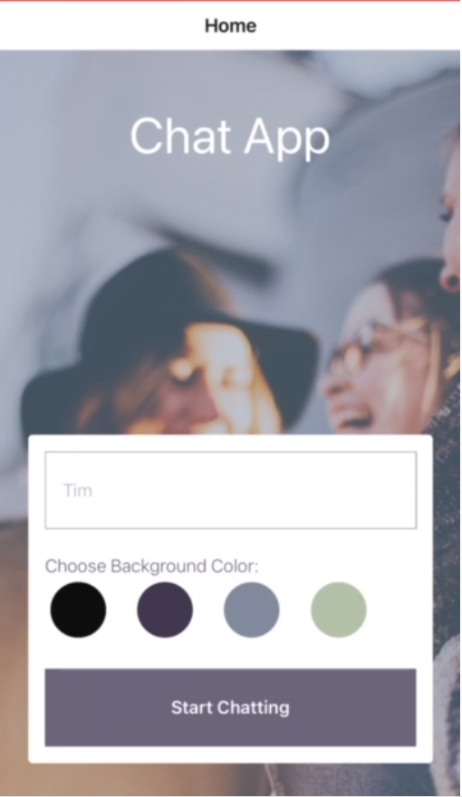

# Native React chat-app
 
## Objective

To build a chat app for mobile devices using React Native. The app will provide users with a chat interface and options to share images and their
location.

## Tech used  
- React Native
- Expo App
- Android Emulator

## User Stories

1. As a new user, I want to be able to easily enter a chat room so I can quickly start talking to my
friends and family.
2. As a user, I want to be able to send messages to my friends and family members to exchange
the latest news.
3. As a user, I want to send images to my friends to show them what I’m currently doing.
4. As a user, I want to share my location with my friends to show them where I am
5. As a user, I want to be able to read my messages offline so I can reread conversations at any
time.
6. As a user with a visual impairment, I want to use a chat app that is compatible with a screen
reader so that I can engage with a chat interface

## Development Process

### Setup Expo as Development Environment

1. Install Expo CLI

```
npm install expo-cli --global
```

2. Create a new expo project

```
expo init [projectname]
```

3. Navigate to the project

```
cd [projectname]
```

4. Start expo project

```
npx expo start
```

### Install React Navigation library to navigate between screens

1. Navigate to project folder and run

```
npm install react-navigation
```

2. Install necessary dependencies

```
"@expo/react-native-action-sheet": "^3.14.0",
"@expo/webpack-config": "^0.17.0",
"@react-native-async-storage/async-storage": "^1.17.10",
"@react-native-community/masked-view": "^0.1.11",
"@react-native-community/netinfo": "9.3.0",
"@react-navigation/native": "^6.0.13",
"@react-navigation/stack": "^6.3.1",
"expo": "~46.0.13",
"expo-status-bar": "~1.4.0",
"firebase": "^8.0.1",
"react": "18.0.0",
"react-native": "0.69.6",
"react-native-gesture-handler": "~2.5.0",
"react-native-gifted-chat": "^1.0.4",
"react-native-paper": "^4.12.5",
"react-native-reanimated": "~2.9.1",
"react-native-safe-area-context": "4.3.1",
"react-native-screens": "~3.15.0",
"react-navigation": "^4.4.4",
"react-native-maps": "0.31.1",
"expo-permissions": "~13.2.0",
"expo-image-picker": "~13.3.1",
"expo-location": "~14.3.0"
```
### Set up Android Studio as Android Emulator

1. Download Android Studio
2. Make sure 'Android Virtual Device' is installed
3. Create virtual device and click play to start
4. Select 'Run app on Android' in Expo to run app on virtual device

### Database configuration:
- Https://firebase.google.com/ and crete a new Google account.
- Go to Firebase console to create project.
- Click on Develop on left in project's dashboard, then create database and follow steps, seleted test mode.
- Click the button icon (</>) under Project Settings on left.
- Choose name for project, click register and copy the code of configuration to components/Chat.js as known: 
  apiKey: '...',
  authDomain: '...',
  projectId: '...',
  storageBucket: '...',
  messagingSenderId: '...',
  appId: '...',
- Click on Authentication on left, to enable anonymous on.
- Click on Storage on left, then Rules on tab, to change "allow read, write: if false;" to "allow read, write: if true;".


